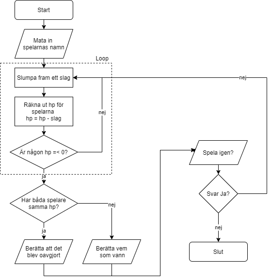

# Slagsmålsspelet
(aka “Swords and sandals fast utan grafik”)

Till hjälp: [C#-dokumentation](https://krank23.gitbook.io/csharp-ref/)

* I den här uppgiften ska du skapa en slagsmålssimulator med **två** inblandade slagskämpar
* Simulatorn ska hålla reda på slagskämparnas **namn** och **hp**
* Det ska finnas en **while-loop** som körs så länge båda slagskämparna har hp kvar
* Varje gång loopen körs – varje “runda” – så ska slagskämpe A slå B, och B ska slå A
* Ett slag innebär att motståndaren blir av med en **slumpmässig** mängd hp
* När striden är slut
  * **Presentera** vinnaren – eller om båda slagskämparna kom under 0 samtidigt, förklara att det blev **oavgjort**
  * Fråga om spelet skall **gå om**
* Observera alltså att i denna grundversion av "spelet" så kan spelaren inte påverka något – hela processen är **automatisk**
* När du är färdig kan du gå vidare och göra uppgiften Slagsmålspelet v2

