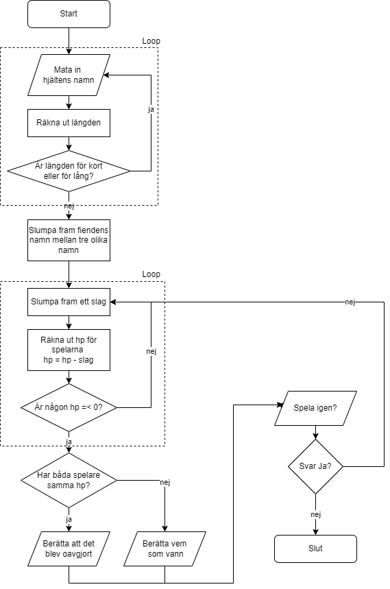

# Slagsmålsspelet v2
Gör först övningen Slagsmålspelet.  

## Enkla förbättringar
* Låt användaren skriva in **namn** på slagskämpe A
* Se till så att användaren hindras från att skriva ett **för kort eller för långt namn** se https://krank23.gitbook.io/csharp-ref/grundlaeggande/datatyper#string
* **Slumpa** mellan **tre** olika namn på slagskämpe B se https://www.progsharp.se/kapitel/5/#skapa-och-anvanda-en-array
* Lägg in **ASCII-art** som föreställer slagskämparna. Är de djur? Pokémon? MMA-fighters?
* Gör så att spelaren kan **starta om** spelet när slagsmålet är över

## Lite mer komplicerade förbättringar
* Gör så att spelaren har **pengar** som hen kan satsa på att hens fighter ska vinna eller förlora
* Gör så att varje “slag” består av två delar: dels huruvida man **träffar** eller **missar**, och dels hur mycket skada man gör om man träffar. Bestäm hur stor **sannolikhet** det ska vara att träffa och använd slump för att avgöra om varje slag träffar
* Gör så att spelaren för varje runda kan **välja** mellan två attacker: en som har låg chans att träffa men har möjlighet att göra mycket mer skada, och en som har högre chans att träffa men riskerar att göra mindre skada.
* Gör så att slagskämpe B **slumpar** vilken av ovan nämnda attacker hen ska göra
* Ge användaren ett **antal poäng** att lägga på sin slagskämpe. Bestäm vilka värden poängen ska kunna läggas på, tex **styrka**, **snabbhet**, **hit points**.
* Gör om det hela till en **sport** – gör så att varje fight bara består av ett specifikt antal rundor, och att vinnaren är den som har mest hp kvar efter sista rundan.
* Låt användaren **välja** antal rundor. Gör så att det finns ett minimum och ett maximum antal rundor användaren kan välja.

## Mycket mer komplicerade förbättringar – kräver nästan garanterat egna efterforskningar
* Låt användaren välja mellan **flera** olika motståndare, som har olika träffsäkerhet, hp och mängd skada.
* Lägg in slagdelen av koden i en **metod**, som tar emot träffchans, minimumskada och maxskada som parametrar och som returnerar den framslumpade skadan (som är 0 om slaget missade).

## FÖRBÄTTRINGAR PÅ EGEN RISK – på nivå som motsvarar Programmering 2
* Skapa en **klass** som beskriver slagskämpar, där värden (namn, hp, träffchans etc) är klassens variabler och där slag-metoden som beskrivs ovan ingår i klassen och inte behöver några parametrar (eftersom den använder instansens värden).
* Skapa en **textfil** där alla motståndares namn och värden står. Läs in informationen och lagra den i instanser av klassen som beskrivs ovan, och lägg instanserna i en array eller lista.
